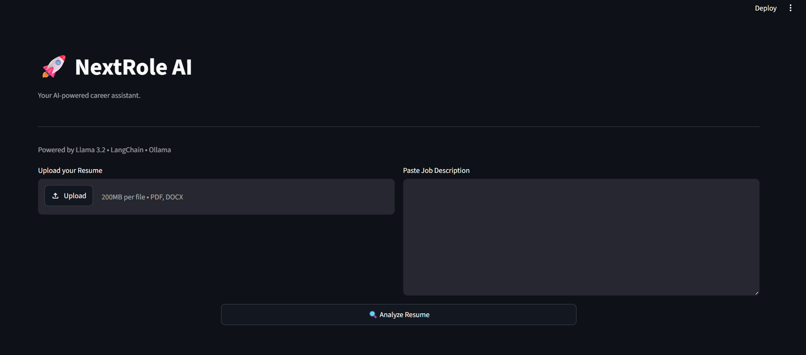
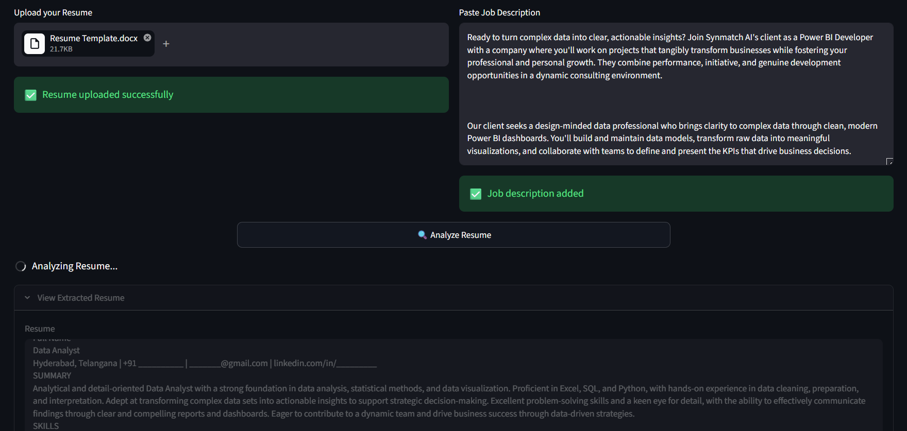
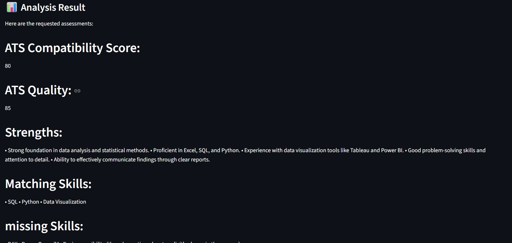

# 🚀 NextRole AI


An AI-powered ATS Resume Analyzer built with Streamlit, LangChain, Ollama, and Llama 3.2 that evaluates resumes against job descriptions and provides structured improvement recommendations.

## Problem Statement

Professionals often apply for multiple job roles, but a single resume cannot effectively represent every skill, project, and experience. As a result, resumes frequently receive low ATS scores because important skills relevant to a specific job description are missing.

NextRole AI aims to solve this problem by analyzing a resume against a job description and providing ATS-style feedback, missing skills, strengths, weaknesses, and actionable recommendations. Future versions will use a Master Profile and Retrieval-Augmented Generation (RAG) to intelligently recommend skills and projects that the user already possesses but has not included in the current resume.

## Features

- Upload resumes in PDF and DOCX formats
- Extract resume text automatically
- Paste any job description
- Analyze resume using Llama 3.2
- Generate ATS compatibility score
- Identify matching skills
- Identify missing skills
- Suggest resume improvements
- Runs completely locally using Ollama (No OpenAI API required)
- Modular project structure

## Why Local LLM?

NextRole AI runs entirely on a local Llama 3.2 model through Ollama. This allows the application to:

- Run without an internet connection
- Avoid API costs
- Keep resume data on the local machine
- Experiment with LLMs without relying on external services

## Tech Stack

| Component | Technology |
|-----------|------------|
| Frontend | Streamlit |
| Backend | Python |
| AI Framework | LangChain |
| LLM | Llama 3.2 |
| Local Runtime | Ollama |
| Document Parsing | pypdf, python-docx |
| IDE | VS Code |

## Project Structure
```
NextRole_AI/
│
├── app.py
├── prompts/
│   └── ats_prompt.py
├── modules/
│   └── analyzer.py
├── utils/
│   └── file_reader.py
├── data/
├── chroma_db/
├── requirements.txt
├── README.md
└── LICENSE
```

## Prerequisites

Before running the project, ensure you have:

- Python 3.10 or later
- Git
- Ollama installed
- Llama 3.2 downloaded

## Installation

1. Clone the repository

```bash
git clone https://github.com/ThanmaiKapa/nextrole-ai
```
2. Move into the project
```bash
cd nextrole-ai
```
3. Create virtual environment
```bash
python -m venv venv
```
4. Activate virtual environment

Windows
```bash
venv\Scripts\activate
```
Mac/Linux
```bash
source venv/bin/activate
```
5. Install dependencies
```bash
pip install -r requirements.txt
```
6. Install Ollama

Visit **https://ollama.com** to Install

7. Pull Llama 3.2
```bash
ollama pull llama3.2
```
8. Run the application
```bash
streamlit run app.py
```
## Usage

1. Upload your resume (PDF or DOCX).
2. Paste the target job description.
3. Click **Analyze Resume**.
4. Review the ATS compatibility score, matching skills, missing skills, strengths, weaknesses, and recommendations.

### Home Page


### Resume and JD upload


### Resume analysis


## Workflow

```
Resume Upload
      │
      ▼
Extract Resume Text
      │
      ▼
Paste Job Description
      │
      ▼
Build ATS Prompt
      │
      ▼
LangChain
      │
      ▼
Ollama
      │
      ▼
Llama 3.2
      │
      ▼
Generate ATS Analysis
      │
      ▼
Display Results
```

## Roadmap

- [x] Version 1.0 - ATS Resume Analyzer
- [ ] Version 2.0 - Master Profile
- [ ] Version 3.0 - Embeddings
- [ ] Version 4.0 - ChromaDB
- [ ] Version 5.0 - RAG
- [ ] Version 6.0 - Resume Generator
- [ ] Version 7.0 - Cover Letter Generator
- [ ] Version 8.0 - Interview Preparation

## Project Status

🚧 Active Development

Current Version: **v1.0**

The project is actively being developed. Future versions will introduce Master Profile support, Embeddings, ChromaDB, Retrieval-Augmented Generation (RAG), Resume Generation, and Interview Preparation.

## Future Enhancements

- Master Profile
- Embedding Generation
- ChromaDB Integration
- Retrieval-Augmented Generation (RAG)
- Resume Generator
- Cover Letter Generator
- Interview Preparation

## License

This project is licensed under the MIT License. See the LICENSE file for details.

## Author

**Thanmai Kapa**
- GitHub: https://github.com/ThanmaiKapa
- LinkedIn: https://www.linkedin.com/in/thanmai-kapa/