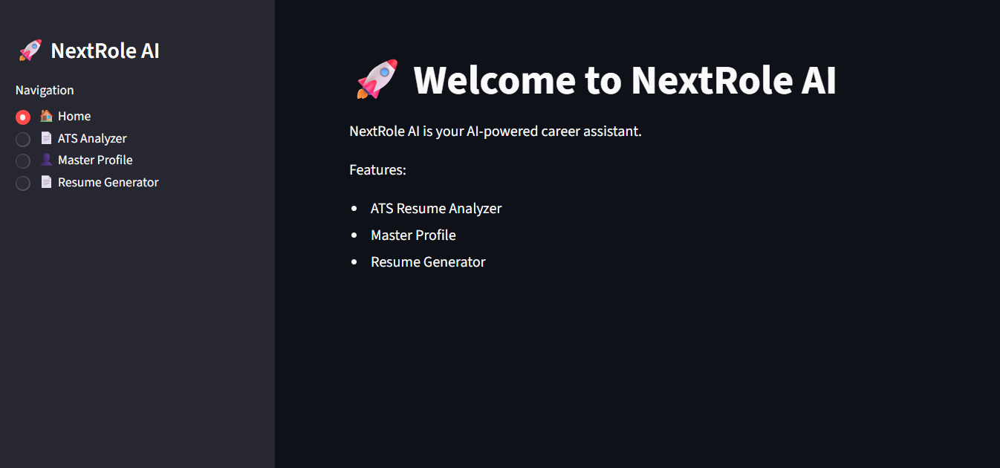
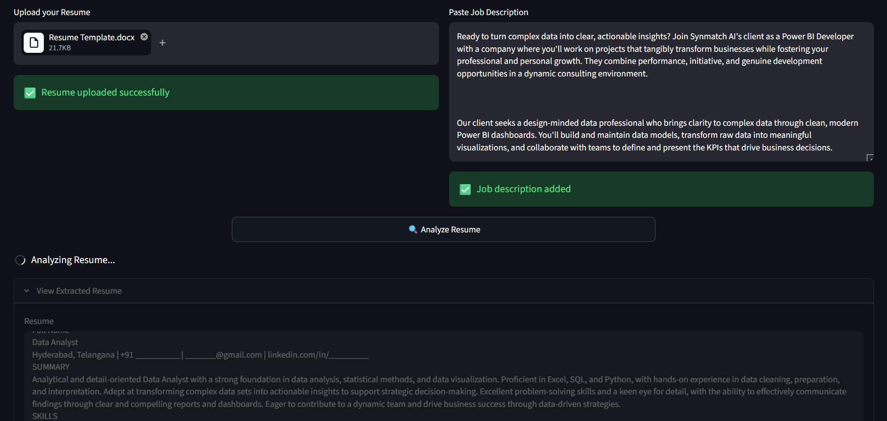
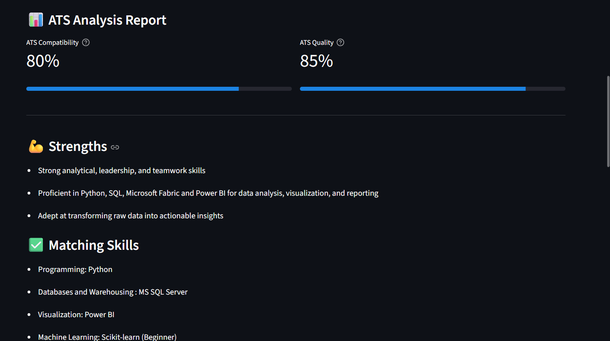
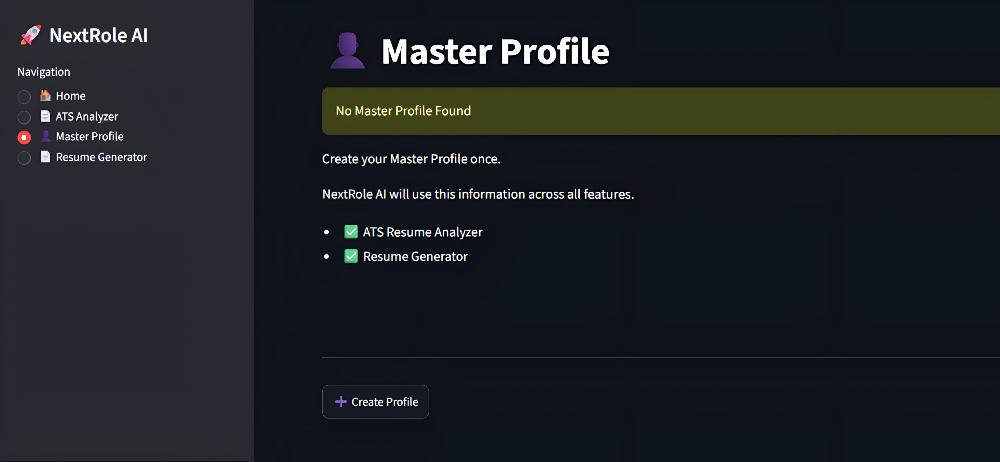
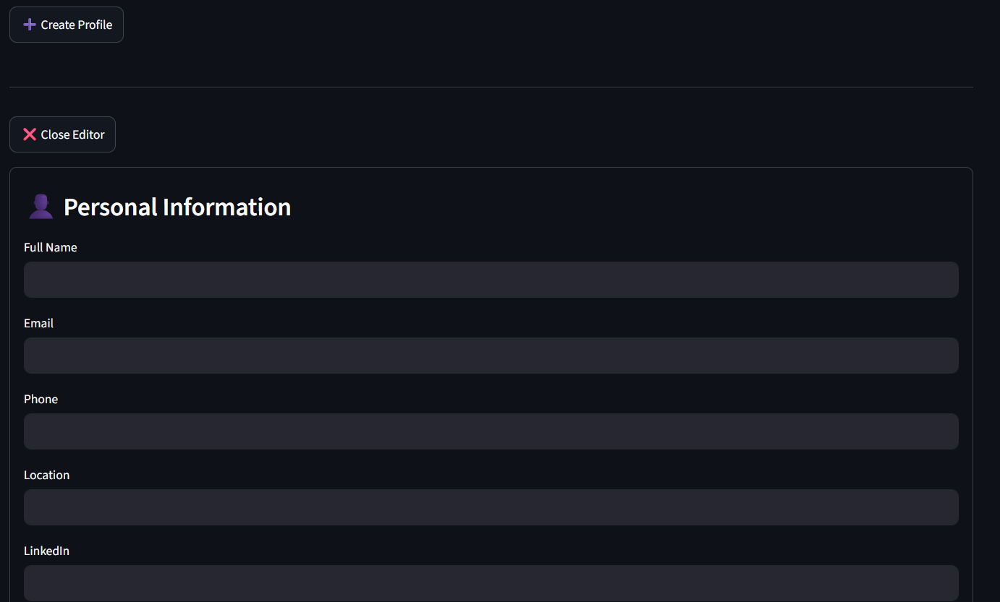
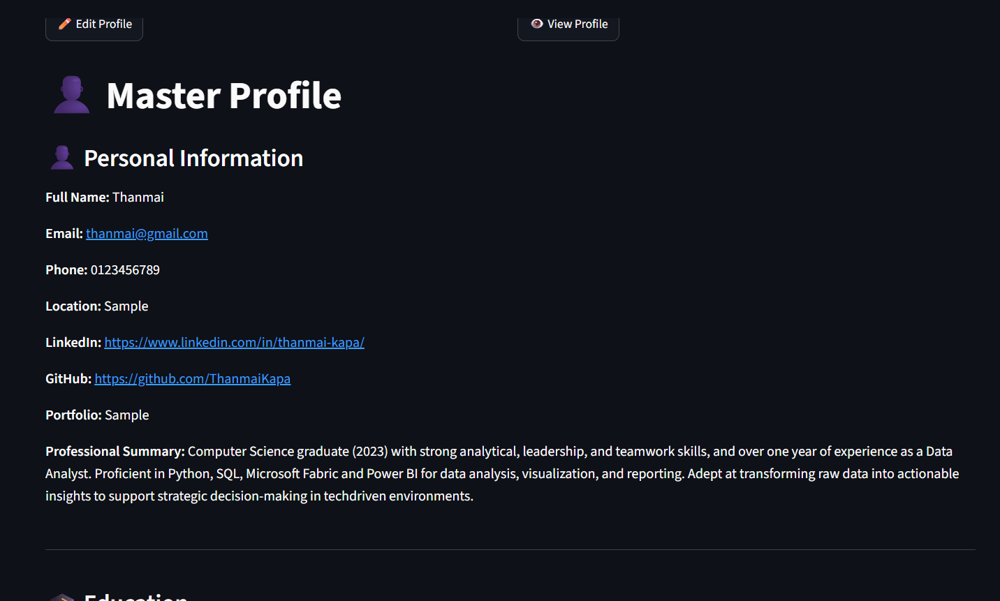
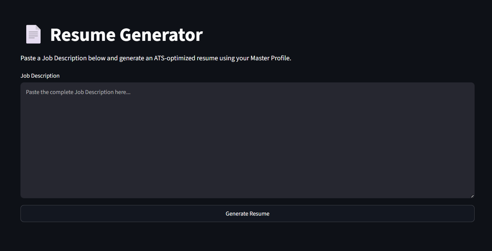
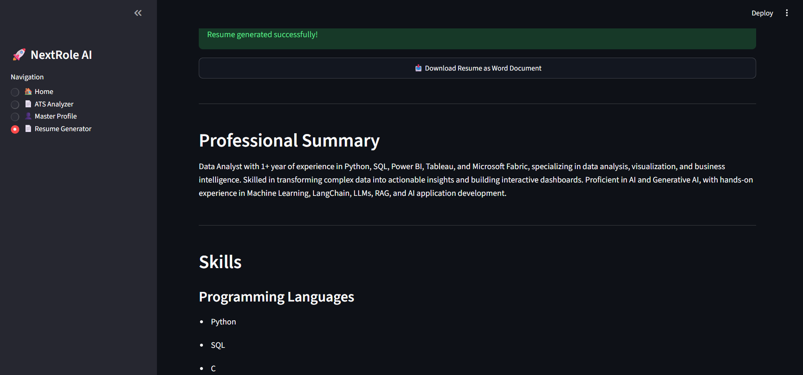
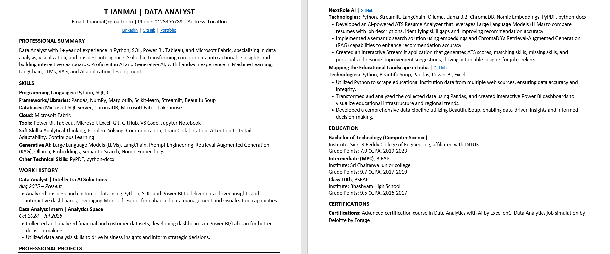

# 🚀 NextRole AI


NextRole AI helps users analyze resumes against job descriptions, maintain a reusable Master Profile, and generate tailored ATS-friendly resumes based on specific job descriptions.

## Problem Statement

Professionals often apply for multiple job roles, but a single resume cannot effectively represent every skill, project, and experience. As a result, resumes frequently receive low ATS scores because important skills relevant to a specific job description are missing. Creating a tailored resume for every job application is also time-consuming, requiring candidates to repeatedly adjust their summaries, experience, skills, and projects.

NextRole AI analyzes resumes against job descriptions using Retrieval-Augmented Generation (RAG). It retrieves relevant information from a reusable Master Profile, validates AI-generated responses, and provides structured ATS-style feedback with strengths, missing skills, weaknesses, and actionable recommendations. It also generates a tailored, ATS-friendly resume based on the target job description and the candidate's Master Profile, significantly reducing the manual effort required to customize resumes for different roles.

## Features

### 📄 ATS Resume Analyzer

- Upload resumes in PDF and DOCX formats
- Extract resume text automatically
- Paste any job description
- Analyze resumes using Llama 3.2
- Retrieval-Augmented ATS Analysis (RAG)
- Generate ATS compatibility and ATS quality scores
- Identify matching skills
- Identify additional relevant skills from the Master Profile
- Identify missing skills
- Identify weaknesses
- Generate actionable improvement recommendations
- Provide an overall candidate recommendation
- Validate AI-generated responses using a post-processing pipeline

### 👤 Master Profile

- Create and maintain a reusable professional profile
- Edit previously saved information
- View profile in a structured format
- Support multiple Education entries
- Support multiple Experience entries
- Support multiple Projects
- Support multiple Certifications
- Manage technical and professional skills
- Section-wise saving
- Input validation
- JSON-based local storage

### 🧠 Embeddings & Semantic Search

- Convert the Master Profile into meaningful text chunks
- Generate embeddings using **nomic-embed-text**
- Automatically regenerate embeddings whenever the profile is updated
- Retrieve the most relevant profile information for a given job description

### 🗄️ ChromaDB Integration

- Store profile embeddings in a persistent ChromaDB collection
- Organize embeddings using collections, documents, IDs, and metadata
- Automatically update the vector database whenever the Master Profile changes
- Perform semantic retrieval using ChromaDB nearest-neighbor search
- Eliminate manual cosine similarity computation

### 🤖 Intelligent ATS Analysis

- Retrieval-Augmented Generation (RAG)
- Response validation pipeline
- Duplicate removal
- Semantic skill validation
- Recommendation validation
- Overall recommendation generation

### 📄 AI Resume Generator

- Generate ATS-friendly resumes based on a target job description
- Retrieve relevant skills and projects from the Master Profile
- Generate a job-targeted professional summary
- Rewrite work experience descriptions while preserving the original information
- Rewrite relevant project descriptions while preserving the original information
- Select relevant professional, academic, and personal projects
- Generate structured resume content using a local LLM
- Generate downloadable Word resumes
- Maintain candidate information from the Master Profile without inventing unsupported experience or skills

### ⚡ General

- Runs locally by default using Ollama
- No OpenAI API required
- Modular project architecture
- Generates downloadable ATS-friendly Word resumes

## Why Local LLM?

NextRole AI uses local AI models through Ollama by default, using Llama 3.2 for language generation and nomic-embed-text for embedding generation.

- Run AI inference locally without requiring an external AI API
- Avoid API costs
- Keep resume data on the local machine
- Experiment with LLMs without relying on external services

## Prompt Customization

NextRole AI uses customizable prompts for ATS analysis and resume generation.

The prompts are located in the `prompts/` directory:

- `ats_prompt.py` - Controls ATS resume analysis
- `resume_generator_prompts.py` - Controls resume generation, including professional summary, work experience, and project descriptions

Users can modify these prompts based on their own requirements, such as:

- Changing the resume writing style
- Adjusting the level of ATS optimization
- Changing the professional summary structure
- Controlling which information should be emphasized
- Changing the output format or level of detail
- Adding additional instructions for specific job roles

The application uses the candidate's Master Profile as the source of truth. When modifying prompts, avoid instructing the LLM to generate information that is not present in the Master Profile.

## Optional: Using Cloud LLM APIs

NextRole AI uses Ollama and Llama 3.2 by default so that AI processing can run locally without requiring a paid API.

For users who prefer potentially stronger or more capable language models, the LLM layer can be adapted to use a cloud-based API provider such as OpenAI, Google Gemini, Anthropic, or another LangChain-supported provider.

Using a more capable API-based model may provide better results for complex resume analysis and generation, but it may require:

- An API key
- Internet connectivity
- Provider-specific dependencies
- Usage-based or subscription costs

The prompts and application logic can be adapted to the selected LLM provider while keeping the Master Profile, retrieval, and resume-generation workflow.

## Tech Stack

| Component        | Technology         |
| ---------------- | ------------------ |
| Frontend         | Streamlit          |
| Backend          | Python             |
| AI Framework     | LangChain          |
| LLM              | Llama 3.2          |
| Embedding Model  | nomic-embed-text   |
| Vector Database  | ChromaDB           |
| Local Runtime    | Ollama             |
| Document Parsing | pypdf, python-docx |
| IDE              | VS Code            |
| Data Storage     | JSON, ChromaDB     |


## Project Structure
```
NextRole_AI/
│
├── app.py
│
├── data/
│   ├── master_profile.json
│   └── chroma_db/
│
├── forms/
│   ├── personal_information_form.py
│   ├── education_form.py
│   ├── experience_form.py
│   ├── skills_form.py
│   ├── projects_form.py
│   └── certifications_form.py
│
├── modules/
│   ├── ats_analyzer.py
│   ├── chunk_manager.py
│   ├── embedding_manager.py
│   ├── profile_manager.py
│   ├── chroma_manager.py
│   ├── master_profile.py
│   ├── validator.py
│   ├── similarity_manager.py
│   ├── resume_generator.py
│   └── word_generator.py
│
├── prompts/
│   ├── ats_prompt.py
│   └── resume_generator_prompts.py
│
├── utils/
│   ├── file_reader.py
│   └── session_state.py
│
├── views/
│   ├── ats_analyzer_page.py
│   ├── resume_generator_page.py
│   ├── home.py
│   ├── master_profile_page.py
│   └── profile_view.py
│
├── images/
│
├── requirements.txt
├── README.md
└── LICENSE
```

## Prerequisites

Before running the project, ensure you have:

- Python 3.10 or later
- Git
- Ollama installed
- Llama 3.2 downloaded
- nomic-embed-text downloaded

## Installation

1. Clone the repository

```bash
git clone https://github.com/ThanmaiKapa/nextrole-ai
```
2. Move into the project
```bash
cd nextrole-ai
```
3. Create virtual environment
```bash
python -m venv venv
```
4. Activate virtual environment

Windows
```bash
venv\Scripts\activate
```
Mac/Linux
```bash
source venv/bin/activate
```
5. Install dependencies
```bash
pip install -r requirements.txt
```
6. Install Ollama

Visit **https://ollama.com** to Install

7. Download Required Models
```bash
ollama pull llama3.2
ollama pull nomic-embed-text
```
8. Run the application
```bash
streamlit run app.py
```
## Usage

### ATS Resume Analyzer

1. Upload your resume (PDF or DOCX).
2. Paste the target job description.
3. Click **Analyze Resume**.
4. Review the ATS score and recommendations.

### Master Profile

1. Open **Master Profile**.
2. Create your professional profile.
3. Add education, experience, skills, projects, and certifications.
4. Save each section independently.
5. View or edit your profile at any time.

### AI Resume Generator

1. Open **Resume Generator**.
2. Paste the target job description.
3. Click **Generate Resume**.
4. Review the generated professional summary, skills, work experience, and projects.
5. Download the generated resume as a Word document.

## Application Screenshots

### Home Page


### ATS Analyzer Page (Resume and JD upload)


### Resume analysis


### Master Profile

#### Create Profile


#### Edit Profile


#### View Profile


### Resume Generator


### Generated Resume


### Word Resume


## Workflow

```
                     Start
                       │
                       ▼
                Open NextRole AI
                       │
          ┌────────────┴────────────┐
          ▼                         ▼
   ATS Resume Analyzer       Master Profile
          │                         │
          ▼                         ▼
 Upload Resume              Create/Edit Profile
          │                         │
          ▼                         ▼
 Extract Resume Text      Save Professional Details
          │                         │
          ▼                         ▼
Paste Job Description      Store Master Profile (JSON)
          │                         │
          ▼                         ▼
 Retrieve Relevant         Generate Profile Chunks
 Master Profile Context            │
          │                        ▼
          ▼                Generate Embeddings
     Build ATS Prompt              │
          │                        ▼
          ▼                Update ChromaDB
      LangChain
          │
          ▼
       Ollama
          │
          ▼
      Llama 3.2
          │
          ▼
 Generate Structured
     ATS Analysis
          │
          ▼
 Validate AI Response
          │
          ▼
 Generate Overall
 Recommendation
          │
          ▼
 Display ATS Report


                     Resume Generator
                           │
                           ▼
                  Paste Job Description
                           │
                           ▼
                 Retrieve Relevant Profile
                           │
                           ▼
             Select Skills & Relevant Projects
                           │
                           ▼
                  Generate Summary
                           │
                           ▼
              Rewrite Experience & Projects
                           │
                           ▼
                   Generate Resume
                           │
                           ▼
                Generate Word Document
                           │
                           ▼
                    Download Resume
```

## Project Versions

- [x] Version 1.0 - ATS Resume Analyzer
- [x] Version 2.0 - Master Profile
- [x] Version 3.0 - Embeddings
- [x] Version 4.0 - ChromaDB
- [x] Version 5.0 - Retrieval-Augmented ATS Analysis
- [x] Version 6.0 - AI Resume Generator and Word Resume Generation

## Project Status

✅ Completed

Current Version: **v6.0**

The project includes an ATS Resume Analyzer, Master Profile management, automatic embedding generation, ChromaDB-powered semantic retrieval, Retrieval-Augmented Generation (RAG), AI-powered resume generation, and downloadable Word resume generation.

## License

This project is licensed under the MIT License. See the LICENSE file for details.

## Author

**Thanmai Kapa**
- GitHub: https://github.com/ThanmaiKapa
- LinkedIn: https://www.linkedin.com/in/thanmai-kapa/